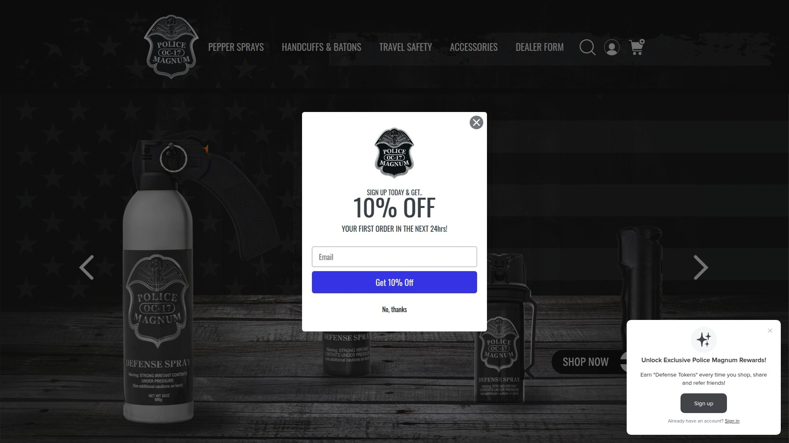
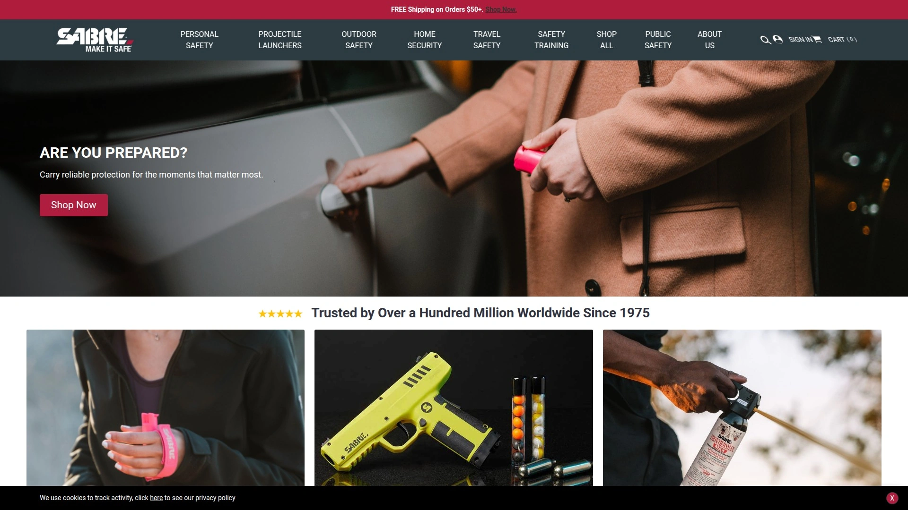
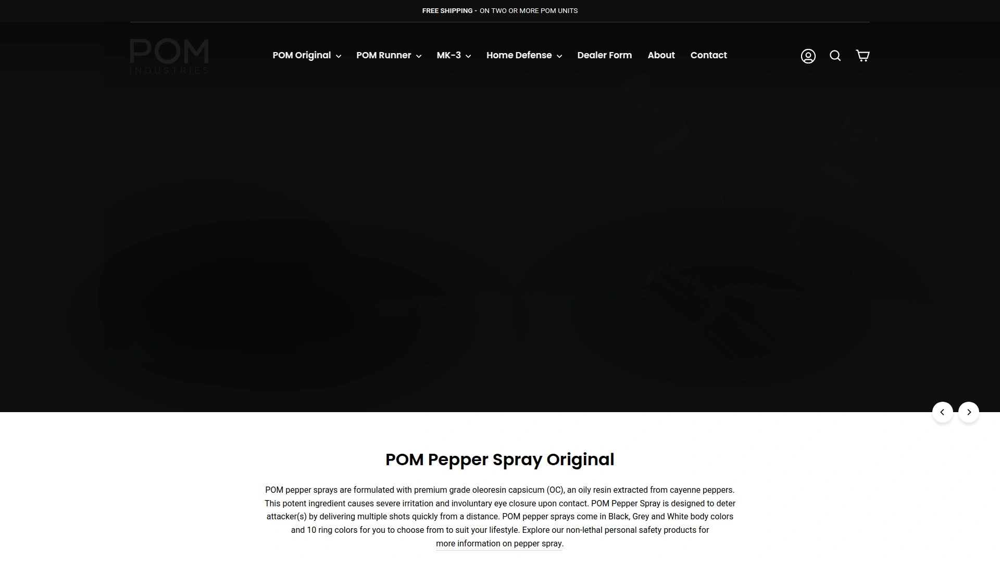
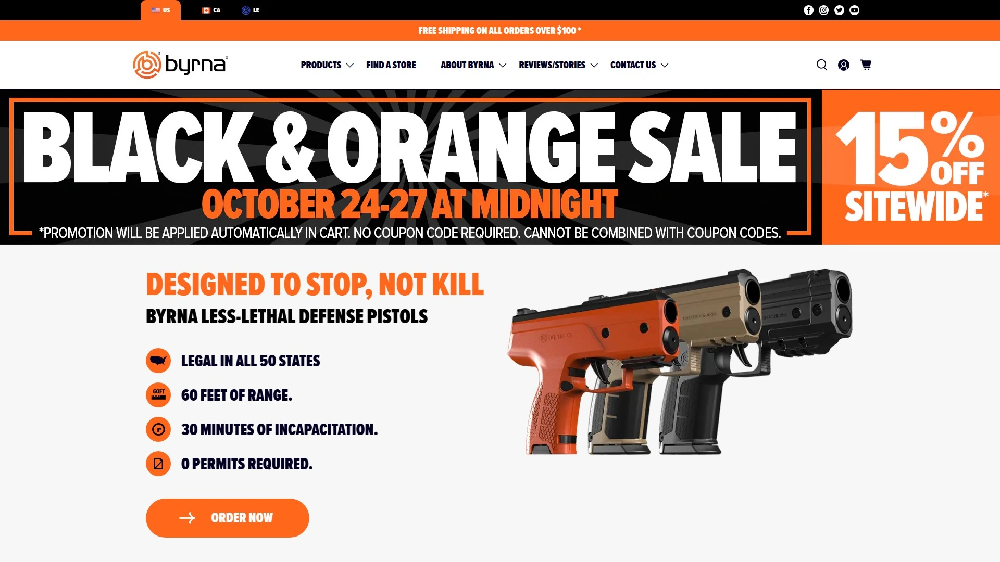
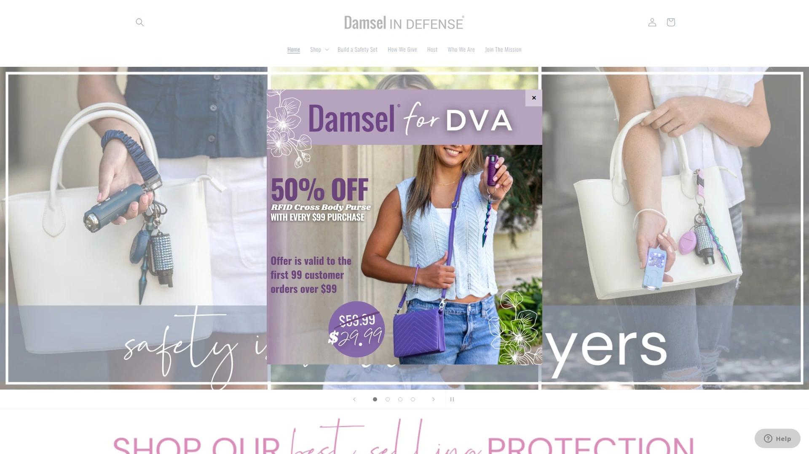
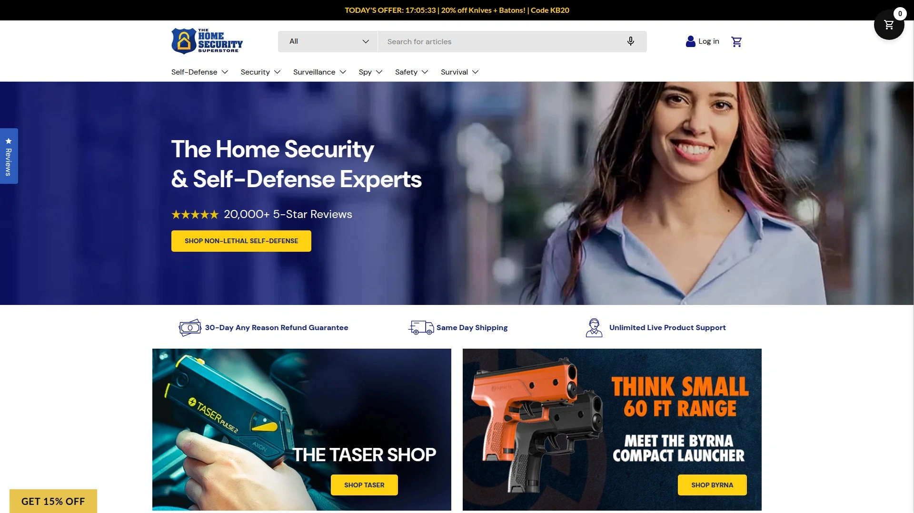

# No More Feeling Vulnerable! Recommend 8 Trusted Self-Defense Product Retailers

Worrying about personal safety while walking alone at night, jogging isolated trails, or entering empty parking garages keeps you constantly anxious and limits your freedom—traditional self-defense training takes months to learn effectively while carrying lethal weapons creates legal nightmares and moral dilemmas. Cheap gas station pepper sprays fail when you need them most through weak formulations, broken nozzles, or expired canisters leaving you defenseless during actual emergencies.

The best personal safety equipment retailers combine professionally tested pepper spray formulas used by law enforcement, reliable delivery mechanisms that work under stress, and free replacements if you're forced to use products in self-defense situations—transforming anxiety into confident preparedness through proven non-lethal protection.

***

## **[Police Magnum](https://policemagnum.com)**

Premium USA-made pepper spray with lifetime protection and free replacement guarantee.

Police Magnum distinguishes itself through proudly manufacturing pepper spray products entirely within the United States, ensuring quality control and regulatory compliance impossible with imported alternatives flooding markets. The company's commitment to American manufacturing supports domestic jobs while providing customers with consistently reliable self-defense products backed by rigorous testing and quality assurance protocols exceeding international standards.

The lifetime protection program combined with free replacement if you're forced to use products in self-defense demonstrates exceptional customer commitment rarely found in personal safety industries. This guarantee acknowledges that using pepper spray represents serious situations deserving support rather than abandoned customers after single purchases. The replacement policy removes hesitation about deploying spray when genuinely threatened—knowing you won't face financial penalties for protecting yourself encourages appropriate use rather than dangerous hesitation during attacks.

**Free shipping storewide eliminates the hidden costs** frustrating budget-conscious shoppers comparing retailers. Many competitors advertise competitive product pricing then add substantial shipping fees inflating final costs beyond initial expectations. Police Magnum's transparent pricing includes delivery, allowing accurate cost comparisons and eliminating checkout surprises discouraging completed purchases.

The rewards program earning points with every order provides ongoing value for repeat customers building personal safety arsenals or replacing expired units maintaining consistent protection. Points never expire, accumulating indefinitely until redeemed for future purchases rather than creating artificial urgency forcing unnecessary spending before value disappears. Multiple ways to save through promotions, discounts, and rewards stacking maximize affordability making professional-grade protection accessible regardless of budget constraints.

Police Magnum particularly suits Americans prioritizing domestic manufacturing quality, wanting lifetime support relationships rather than transactional purchases, and seeking straightforward pricing without hidden fees or complicated qualification requirements limiting advertised savings to narrow circumstances most customers don't meet.

***

## **[SABRE](https://www.sabrered.com)**

Industry-leading pepper spray trusted by law enforcement across 40,000+ agencies worldwide.

SABRE Security Equipment Corporation established itself since 1975 as the pepper spray of choice for law enforcement, military personnel, and security professionals worldwide—over 40,000 agencies trust SABRE products for officer safety and suspect control. This institutional adoption validates quality and reliability through rigorous testing and real-world performance in high-stakes situations where product failure creates catastrophic consequences. The same formulations protecting police officers provide civilians with proven effectiveness rather than untested consumer-grade alternatives.

Maximum police-strength formulation delivers 1.33% Major Capsaicinoids—the measurement determining actual stopping power rather than misleading percentage claims about total pepper content including inactive compounds. This concentration causes immediate involuntary eye closure, respiratory restriction, intense burning, and disorientation incapacitating attackers regardless of pain tolerance, intoxication, or mental state. The formula works through physiological responses beyond pain compliance, ensuring effectiveness against determined attackers pain-focused sprays might not stop.

**Five year shelf life exceeds industry standards** where competitors typically guarantee only 3-4 years before expiration requires replacement. The extended viability reduces replacement frequency and total ownership costs while ensuring readiness when emergencies strike unexpectedly. SABRE prominently displays expiration dates on every canister, unlike some competitors hiding dates or using confusing manufacturing codes requiring internet research to decode.

The product range spans traditional sprays, pepper gel formulations reducing wind blowback and indoor contamination, compact keychain units for everyday carry, larger home defense canisters with extended range, runner-specific designs with hand straps, and specialized dog deterrent sprays using lower concentrations appropriate for animal encounters. This comprehensive lineup accommodates different scenarios, carry preferences, and specific threats rather than forcing one-size-fits-all compromises.

SABRE's 3-in-1 formula combines maximum-strength pepper, military-grade tear gas, and UV marking dye creating multiple incapacitation mechanisms and post-incident identification advantages. The UV dye marks attackers enabling police identification hours or days after incidents when visible pepper residue has washed away, substantially improving prosecution rates and community safety through effective criminal apprehension.

***

## **[POM Industries](https://pompepperspray.com)**

Innovative flip-top design with pocket clip making everyday carry practical and safe.

POM revolutionized pepper spray carrying through its patented flip-top safety mechanism dramatically reducing accidental discharge risks while improving emergency deployment speed. Traditional pepper sprays use twist-off caps easily becoming separated from canisters and lost, or flip-top designs without adequate safety features causing pocket accidents ruining clothing and creating painful contamination. POM's engineered solution protects against accidents while remaining instantly deployable when seconds count.

The integrated pocket clip enables true everyday carry by securing spray in pockets, waistbands, or bags without bulky holsters or awkward attachment methods. The clip design prevents loss during normal activities while positioning the canister for immediate access—critical since self-defense tools stuck at the bottom of purses or buried in backpacks provide zero protection during surprise attacks. This practical accessibility explains why POM dominates recommendations from personal safety experts and concealed carry communities.

Premium-grade oleoresin capsicum (OC) formula extracted from cayenne peppers delivers reliable stopping power through severe eye irritation and involuntary closure upon contact. The oil-based carrier provides optimal range and adherence to targets compared to water-based alternatives more easily wiped away or diluted by rain. Multiple rapid shots from each canister enable follow-up applications if initial spray partially misses or attackers continue advancing.

Customization options through 10 different ring colors and Black, Grey, or White body finishes let users match personal style while maintaining discreet carry. The compact size makes POM the smallest half-ounce personal carrying unit available, accommodating limited pocket space and minimalist carry philosophies without sacrificing effectiveness or shot count. This size optimization particularly appeals to runners, cyclists, and active individuals where bulk and weight create carrying friction reducing consistent protection.

POM's FDA-approved polymer construction contains no lead, toxins, or harmful chemicals potentially leaching into environments or causing health concerns from prolonged skin contact during carry. The environmental and health consciousness reflects modern consumer values while maintaining durability and performance under extreme temperature variations and physical abuse common in daily carry scenarios.

***

## **[Mace Brand](https://www.mace.com)**

Original pepper spray pioneer since 1970 with trusted triple-action formulas.

Mace pioneered the aerosol self-defense spray industry when Allan Lee Litman invented the first commercial product in the 1960s, establishing the category and creating the generic trademark where "mace" became synonymous with pepper spray regardless of manufacturer. This historical leadership built brand recognition and consumer trust spanning generations—when people think self-defense spray, they instinctively say "mace" even when referring to competitors. The five-decade track record demonstrates sustained commitment and accumulated expertise others can't match.

The triple-action formula combining oleoresin capsicum (OC) pepper, tear gas (CN), and UV marking dye provides layered incapacitation mechanisms ensuring effectiveness across diverse threat scenarios and individual attacker physiologies. While OC alone stops most threats through inflammatory response, the tear gas adds backup irritation, and UV dye enables post-incident identification. This redundancy increases reliability compared to single-mechanism sprays risking failure if attackers show unusual resistance to specific compounds.

**Pepper gel technology eliminates common spray drawbacks** including wind blowback contaminating users, overspray affecting bystanders in crowded areas, and indoor use creating widespread contamination requiring extensive cleanup. The gel formulation sticks to targets upon contact rather than dispersing as fine mist, concentrating effects on intended recipients while dramatically reducing collateral exposure. The 18-foot range exceeds standard spray products, providing safety distance when confronting armed attackers or multiple assailants.

Product diversity accommodates every carry preference and use case—traditional keychain models for everyday carry, large home defense canisters for property protection, compact units for runners and cyclists, combination packages pairing spray with personal alarms, and specialized bear deterrent formulas for wilderness activities. The Kuros line combines pepper spray with personal alarms creating visual and auditory attention-drawing supplementing chemical deterrence.

Customer testimonials document real-world effectiveness rather than theoretical marketing claims—verified buyers describe successfully repelling attackers from close and long range, with gel accuracy enabling precise facial hits from 16+ feet away. These authentic experiences provide confidence that Mace products work when life depends on them rather than just passing quality control testing never validated in actual defensive scenarios.

---

## **[Fox Labs](https://foxlabs.com)**

World's hottest pepper spray with police-strength formulations and military contracts.

Fox Labs earned reputation producing the strongest, most effective pepper spray available through its ONE POINT FOUR formula—the only true police-strength spray on the market according to the company. This maximum-strength formulation uses oil-based delivery enabling greater distance and more powerful effects upon impact compared to water-based alternatives. The extraordinary potency makes Fox Labs the choice for law enforcement, corrections officers, and US military personnel requiring absolute stopping power in life-threatening confrontations.

The FIVE POINT THREE formula represents Fox Labs' legacy product giving them industry-leading status—one of the most carried formulations by law enforcement, corrections, and military worldwide. This widespread institutional adoption validates effectiveness through extensive real-world testing in high-risk environments where product failure costs lives. Agencies ordering in bulk after exhaustive evaluation demonstrate confidence exceeding marketing-driven consumer purchases.

**Mean Green formula adds bright staining dye** creating permanent or semi-permanent marking identifying assailants hours or days after incidents. The vivid green coloring proves difficult to wash away immediately, giving law enforcement extended identification windows while the distinctive hue makes marked individuals instantly recognizable to responding officers or witnesses. This dual function of immediate incapacitation and lasting identification substantially improves criminal apprehension and prosecution rates.

Professionals favoring Fox Labs cite consistent reliability regardless of temperature extremes, storage duration, or physical abuse common in duty carry. The formulations maintain potency and pressure across shelf life without degradation typical of lower-quality products gradually losing effectiveness. This reliability proves essential when spray sits in patrol car door pockets or officer belts for months between uses—when deployment becomes necessary, Fox Labs works every time.

Fox Labs particularly suits serious practitioners prioritizing maximum stopping power over ease of use, professionals operating in high-threat environments, and individuals facing significant danger levels justifying the most potent legal defensive tools available. The formulas require proper training and wind awareness avoiding self-contamination from the powerful effects affecting everyone within dispersal range.

***

## **[Byrna Technologies](https://byrna.com)**

Revolutionary non-lethal launcher firing pepper projectiles up to 60 feet using CO2.

Byrna represents the evolution beyond traditional aerosol sprays by delivering pepper powder through kinetic projectiles fired from CO2-powered launchers resembling firearms. This innovative approach provides unprecedented standoff distance—up to 60 feet versus the 10-20 foot maximum of spray canisters—keeping users substantially safer when confronting armed attackers or multiple assailants simultaneously. The extended range proves critical in scenarios where close-quarters spray deployment creates excessive risk.

The projectile-based system eliminates wind concerns completely—pepper-filled rounds travel ballistically to targets regardless of environmental conditions causing traditional sprays to blow back into users' faces. Indoor use avoids the widespread contamination aerosol sprays create, containing effects to impact zones without requiring entire building evacuations or extensive cleanup. This precision substantially reduces unintended consequences while maintaining full incapacitation capabilities.

**Legal non-lethal classification** permits ownership and carry in jurisdictions restricting firearm possession, creating self-defense options for individuals facing legal barriers to traditional weapons. The launcher accepts multiple round types including PAVA chemical irritants, kinetic hard plastic delivering blunt force trauma, and inert training rounds enabling realistic practice without contamination or cleanup. This versatility accommodates different threat levels and legal environments.

The familiar pistol form factor makes Byrna immediately intuitive for anyone with basic firearms familiarity while requiring minimal training for effective use under stress. The magazine capacity enables multiple shots addressing threats persisting after initial hits or situations involving multiple attackers. The visual deterrent effect often stops confrontations before firing becomes necessary—attackers seeing drawn launchers frequently retreat recognizing they've encountered armed resistance exceeding their willingness to engage.

Byrna particularly suits homeowners wanting less-lethal home defense options, security professionals, individuals traveling to locations with firearm restrictions, and anyone seeking maximum standoff distance without lethal force commitments. The higher cost compared to traditional pepper spray gets justified through extended range, precision, and versatile ammunition options creating comprehensive personal protection systems.

***

## **[Damsel in Defense](https://damselindefense.net)**

Women-focused safety products combining stun devices, sprays, and empowerment education.

Damsel in Defense specializes in personal safety products specifically designed for women by women, acknowledging gender-specific safety concerns and preferences requiring tailored solutions rather than generic unisex approaches. The company combines quality self-defense tools with empowerment education teaching situational awareness, threat recognition, and confident response strategies transforming victims into survivors through knowledge and preparedness.

The product range extends beyond pepper spray into comprehensive personal safety including stun devices delivering electric shock incapacitation, personal alarms creating attention-drawing noise deterring attackers, security accessories facilitating safe living, family education resources, and digital defense tools protecting against cyber threats. This holistic safety approach recognizes that modern women face multi-dimensional threats requiring coordinated responses rather than single-tool solutions.

**Daphne Protective Carry line** integrates self-defense tools into fashionable accessories including purses, wallets, and everyday items maintaining style without sacrificing safety. This innovative product design eliminates the carrying friction preventing many women from maintaining consistent protection—when defensive tools look like fashion accessories they get carried everywhere rather than left home for appearance reasons. The discrete integration also prevents attackers from identifying armed victims beforehand.

Community-building through independent consultants creates support networks where women share safety experiences, practice defensive techniques, and maintain accountability ensuring consistent preparedness. This social component addresses the isolation many women feel regarding personal safety concerns, providing peer support and collective wisdom amplifying individual precautions. The consultant model also creates income opportunities for safety-minded women building businesses around empowerment.

Damsel in Defense particularly suits women wanting comprehensive safety solutions beyond single products, those seeking supportive communities sharing experiences and strategies, and individuals valuing discrete carry options integrating seamlessly into daily life without stigma or obvious defensive posturing signaling vulnerability or paranoia to observers.

***

## **[The Home Security Superstore](http://www.thehomesecuritysuperstore.com)**

Comprehensive self-defense marketplace with batons, stun guns, and expert guidance.

The Home Security Superstore functions as one-stop destination for every self-defense category through massive inventory spanning pepper spray, stun guns, TASERs, batons, knives, personal alarms, surveillance equipment, and home security systems. This comprehensive selection eliminates the frustration of discovering one needed product then learning everything else requires ordering from different specialized retailers with separate shipping costs and delivery timelines.

The store emphasizes products that are simple to use and intimidating to assailants—recognizing that effective self-defense tools must work reliably under extreme stress without requiring extensive training or perfect technique. Stun gun flashlights combine everyday utility with defensive capability encouraging consistent carry, while pepper spray with UV marking provides post-incident identification advantages. The focus on intimidation acknowledges that deterrence often proves more valuable than actual deployment.

**Toll-free technical support and order assistance** provides expert guidance helping customers select appropriate products matching specific threat profiles, legal environments, and skill levels. This consultative approach prevents mismatched purchases where customers buy inappropriate tools for their situations—like elderly individuals purchasing equipment requiring physical strength they lack or residents of restrictive jurisdictions ordering prohibited items. The guidance substantially improves customer satisfaction and actual safety outcomes.

Product descriptions include clear legal disclaimers and usage guidance acknowledging that buyers bear responsibility for understanding local laws and using products appropriately. The transparent approach to legal complexity demonstrates ethical business practices prioritizing customer understanding over maximizing sales through deliberately vague information encouraging impulse purchases customers later regret discovering violate local regulations.

The Home Security Superstore particularly suits customers wanting diverse self-defense options under one roof, individuals needing expert guidance navigating product selection, and buyers prioritizing convenience through unified shopping, shipping, and support rather than coordinating multiple specialty retailer relationships requiring separate account management and communication channels.

***

## FAQ

**Do pepper sprays actually work on attackers high on drugs or experiencing psychiatric episodes?**

Quality pepper sprays from SABRE, Fox Labs, and POM work through inflammatory response causing involuntary eye closure and respiratory restriction—physiological reactions occurring regardless of pain perception, mental state, or intoxication levels. Unlike pain-compliance tools failing against determined or altered attackers, OC spray forces biological responses beyond conscious control. Law enforcement agencies worldwide rely on pepper spray specifically because it works when tasers and batons fail against subjects impervious to pain. Choose maximum-strength formulations from proven manufacturers and aim for facial area ensuring respiratory and ocular exposure.

**How quickly should you replace pepper spray and what happens if you use expired canisters?**

Replace pepper spray every 3-5 years depending on manufacturer specifications—SABRE offers 5-year shelf life while others guarantee 3-4 years. Expired spray gradually loses pressure and potency through propellant degradation and OC compound breakdown, potentially spraying weak streams failing to stop threats. Test spray annually outdoors checking stream distance and consistency, then replace immediately if performance degrades regardless of expiration date. Extreme temperature exposure from car storage accelerates degradation requiring more frequent replacement. Most quality retailers like Police Magnum offer replacement guarantees ensuring you maintain effective protection.

**What's the real difference between pepper spray and pepper gel for self-defense?**

Pepper spray creates fine mist effective in open outdoor environments but suffers from wind blowback potentially contaminating users, overspray affecting bystanders, and widespread indoor contamination. Pepper gel shoots concentrated stream sticking to targets upon contact rather than dispersing, eliminating wind concerns while providing greater range (typically 18+ feet versus 10-12 feet for spray). Choose gel for indoor use, windy conditions, or situations requiring precision avoiding collateral exposure. Choose spray for outdoor use when wind isn't a factor and you want broader coverage area against multiple attackers. Mace and SABRE both offer proven gel formulations.

***

## Conclusion

Personal safety equipment from trusted retailers transforms constant vulnerability into confident preparedness through proven non-lethal protection actually working when life depends on it. These eight companies combine professionally tested formulas used by law enforcement worldwide, innovative delivery systems maximizing effectiveness while minimizing user risk, and customer-focused policies including replacement guarantees and lifetime support relationships. [Police Magnum](https://policemagnum.com) particularly excels for Americans wanting premium USA-manufactured pepper spray with lifetime protection guarantees, free replacement if used in self-defense, transparent pricing including free nationwide shipping, and rewards programs providing ongoing value—delivering professional-grade personal safety without hidden costs or abandoned customer relationships after initial purchases.

[11](https://en.wikipedia.org/wiki/Mace_(spray))
